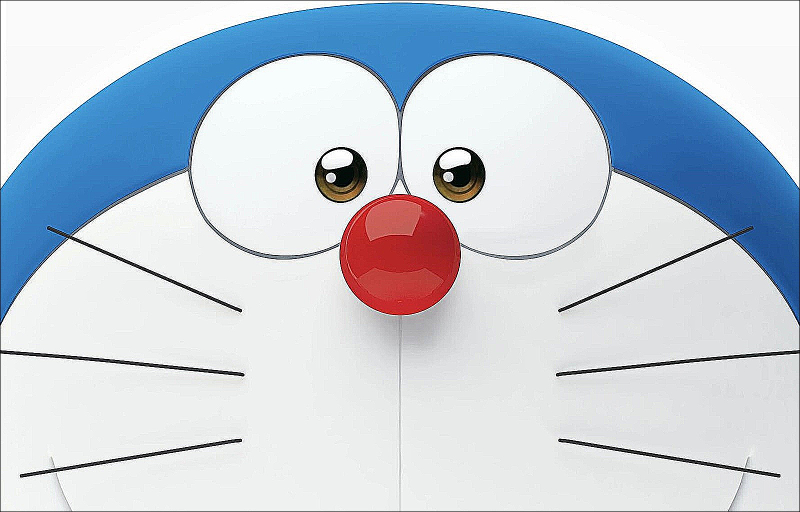

# 并行计算Lab5实验报告
方驰正PB21000163
## 一、实验目的
使用cuda编写并行程序，加速图像锐化卷积算法。
## 二、实验过程
### 1.串行算法设计
我们使用opencv库读取图片，并使用锐化卷积算法锐化图片。

具体地，我们使用以下卷积核，对图片进行锐化：
```
-1 -1 -1
-1  9 -1
-1 -1 -1
```
主要代码如下：
```cpp
Mat sharpen(Mat &src) {
    Mat dst(src.n, src.m);
    for (int i = 1; i < src.n - 1; i++) {
        for (int j = 1; j < src.m - 1; j++) {
            int sum = 0;
            sum += src(i - 1, j - 1) * -1;
            sum += src(i - 1, j) * -1;
            sum += src(i - 1, j + 1) * -1;
            sum += src(i, j - 1) * -1;
            sum += src(i, j) * 9;
            sum += src(i, j + 1) * -1;
            sum += src(i + 1, j - 1) * -1;
            sum += src(i + 1, j) * -1;
            sum += src(i + 1, j + 1) * -1;
            dst(i, j) = sum;
        }
    }
    return dst;
}
```
如下所示，左图为原图，右图为锐化后的图：
<div style="display: flex; flex-direction: row;">
  <div style="flex: 1;">
    
    <p style="text-align: center;">原图</p>
  </div>
  <div style="flex: 1;">
    
    <p style="text-align: center;">锐化后</p>
</div>


观察图片的边缘，我们可以看到锐化后的图片边缘更加清晰。说明该算法达到了我们预期的效果。

### 2.并行算法设计
我们编写了cuda程序，对图片进行锐化。

由于串行算法中每个结果的计算是独立的，因此可以直接将其改写为并行算法。核心代码如下：
```c++
__global__ void sharpen(int *src, int *dest, int n, int m) {
    int id = blockIdx.x * blockDim.x + threadIdx.x;

    for (int i = id; i < n * m; i += blockDim.x * gridDim.x) {
        int x = i / m;
        int y = i % m;
        if (x > 0 && x < n - 1 && y > 0 && y < m - 1) {
            int sum = 0;
            sum += src[(x - 1) * m + y - 1] * -1;
            sum += src[(x - 1) * m + y] * -1;
            sum += src[(x - 1) * m + y + 1] * -1;
            sum += src[x * m + y - 1] * -1;
            sum += src[x * m + y] * 9;
            sum += src[x * m + y + 1] * -1;
            sum += src[(x + 1) * m + y - 1] * -1;
            sum += src[(x + 1) * m + y] * -1;
            sum += src[(x + 1) * m + y + 1] * -1;
            dest[x * m + y] = sum;
        }
    }
}
```
### 3.性能分析
我们使用了一张分别率为`1600*1024`的图片进行测试。通过将图片分解为RGB三个通道，并对每个通道锐化后合并。

分别对cpu程序与gpu程序进行了性能测试，结果如下：
```
CPU time: 0.064649

CPU copy to GPU time: 0.002563s
GPU time: 0.000646s
GPU copy to CPU time: 0.004274s
```
计算加速比$S=\frac{T_{cpu}}{T_{gpu}}=100.15$，说明cuda程序的加速效果非常明显。

同时，我们可以看到数据传输时间占全过程的91.4%，说明数据传输是性能瓶颈。
## 三、实验总结
通过本次实验，我们学习了cuda编程，并实现了一个简单的图像锐化算法。我们发现cuda程序的性能比cpu程序有了显著提升，但数据传输仍然是性能瓶颈。在实际应用中，我们应该尽量减少数据传输的次数，以提高程序性能。